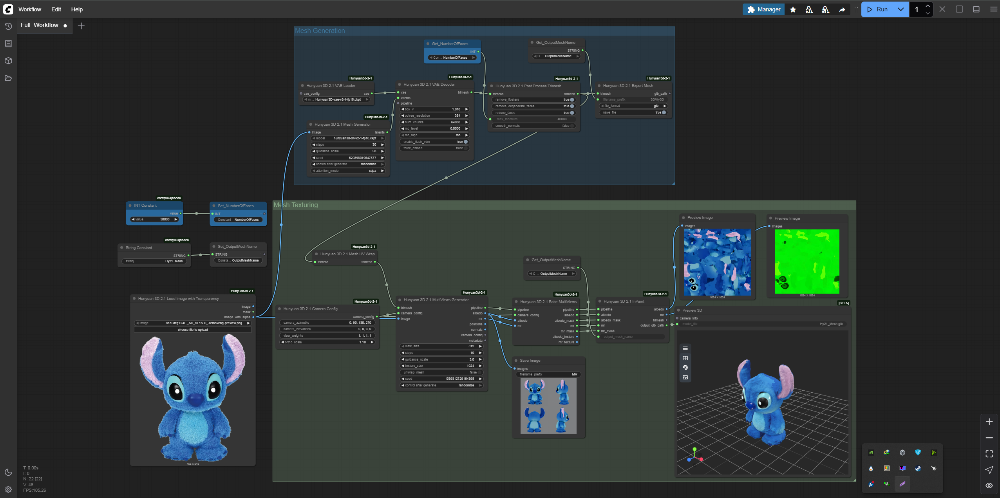
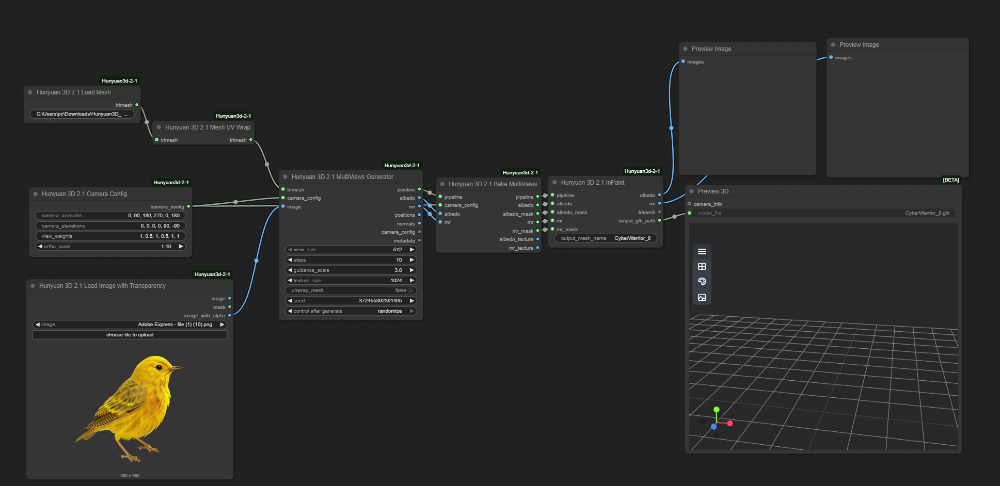

# Dataset Generation Pipeline — Hunyuan3D + Unity

This document explains how the Unity simulation training dataset (`dataset_unity`) was generated.
The pipeline converts **reference images of real species** into **3D `.glb` models** that are
placed inside Unity biome scenes and rendered from drone camera angles to produce labeled training data.

---

## Overview

```
Reference images of species
        │
        ▼
  Hunyuan3D-1  (via ComfyUI)
  ─ image-to-3D generation
  ─ outputs .glb mesh + texture
        │
        ▼
  Unity DataGeneration scene
  ─ places .glb models in biome environments
  ─ drone camera flies random trajectories
  ─ YOLODataGenerator.cs auto-saves
    frames + bounding box labels
        │
        ▼
  dataset_unity/
  ├── images/{train,val,test}
  └── labels/{train,val,test}
        │
        ▼
  train_unity.py  →  best.onnx  →  Unity runtime inference
```

---

## Step 1 — 3D Model Generation with Hunyuan3D

**Tool:** [Hunyuan3D-1](https://github.com/Tencent/Hunyuan3D-1) via [ComfyUI](https://github.com/comfyanonymous/ComfyUI)

**Custom nodes used:**
- `ComfyUI-Hunyuan3d-2-1`
- `ComfyUI-Hunyuan3DWrapper`
- `comfyui-kjnodes`
- `comfyui-logicutils`

### ComfyUI Workflows

We use two primary workflows for generating the assets, which you can load directly into ComfyUI from the `workflows/` directory.

#### 1. Full Pipeline Workflow

*(Found in `workflows/Full Workflow.json`)*

#### 2. Mesh Texturing Workflow

*(Found in `workflows/Mesh_Texturing.json`)*

### Process

1. Launch ComfyUI using the portable Windows package
2. Load the relevant workflow from `docs/hunyuan3d/workflows/`
3. For each species, provide a clean reference image (front-facing, white/neutral background works best)
4. Run the workflow — Hunyuan3D generates a `.glb` file with mesh and baked texture
5. Save output to the relevant biome folder under `Species/`

### Species generated (by biome)

| Biome | Species |
|-------|---------|
| Boreal Forest | Beaver, Birch Tree, Lynx, Marten, Squirrel ×2, Warbler, Woodpecker |
| City | Abandoned Car ×2, Bicycle, Calico Cat, Coyote, Crow, Feral Dog, Pigeon, Rat, Skeleton |
| Coastal Desert | Agave, Cactus, Desert Bighorn Sheep, Desert Tortoise, Desert Willow, Dorcas Gazelle, Pelican ×2, Rattlesnake, Seabird |
| Mountain | Alpine Marmot, Edelweiss, Elk, Golden Eagle, Grizzly Bear, Heather, Mountain Lion, Rhododendron |
| Plains | Bison ×2, Black-footed Ferret, Buffalograss, Burrowing Owl, Hyena, Lion, Ornate Box Turtle, Pipit, Plains Elephant, Quail, Zebra |
| Rain Forest | Big Snake ×2, Cacao Tree, Capybara, Gorilla, Green Anaconda, Green Iguana, Leopard, Okapi, Orchid, Pangolin, Pygmy Chimpanzee, Sloth |
| Subtropical Desert | Aloe Vera, Date Palm, Desert Scorpion, Dromedary Camel, Fennec Fox, Gecko, Horned Lizard, Jerboa, Salvia Plant |
| Temperate Forest | American Black Bear, Hickory, Maple, Raccoon, Red Fox, White-tailed Deer, Wood Frog |

---

## Step 2 — Unity Data Generation

The `.glb` models are imported into the Unity `DataGeneration` scene
(see `dgis-simulation` repo → `Assets/DataGeneration/`).

**Key scripts:**
- `YOLODataGenerator.cs` — spawns models, randomizes position/rotation/lighting, captures drone-POV frames, writes YOLO-format `.txt` label files
- `YOLOClassConfig.asset` — maps each species to a class index

**Parameters used during generation:**

| Parameter | Value |
|-----------|-------|
| Image size | 640 × 640 |
| Drone altitude range | 10 – 80 m |
| Lighting variations | Day, overcast, golden hour |
| Backgrounds | All 7 biome skyboxes |
| Augmentations | Random rotation, scale jitter |

Output lands in `Assets/DataGeneration/Scenes/` and is then copied to `dataset_unity/`.

---

## Reproducing the Dataset

### Requirements
- Windows 10/11 with NVIDIA GPU
- [Hunyuan3D-1 ComfyUI package](https://github.com/Tencent/Hunyuan3D-1) — download separately, not included in this repo
- Unity 2022.3 LTS with the `dgis-simulation` project

### Steps
1. Set up Hunyuan3D ComfyUI following their official instructions
2. Copy the workflows from `docs/hunyuan3d/workflows/` into ComfyUI's workflow loader
3. Run image-to-3D for each species reference image
4. Import resulting `.glb` files into Unity under `Assets/DataGeneration/Prefabs/`
5. Run the `DataGeneration` scene in Unity — dataset auto-saves to disk
6. Copy output to `dataset_unity/{images,labels}/{train,val,test}`
7. Run `python scripts/train_unity.py`

---

## Notes

- The `Species/` folder structure from Hunyuan3D maps 1:1 to `Assets/Species/` in the Unity project
- `.glb` files are **not committed** to this repo (large binary assets) — they live in the Unity project under Git LFS
- ComfyUI model weights (Hunyuan3D checkpoints) must be downloaded separately per their license
